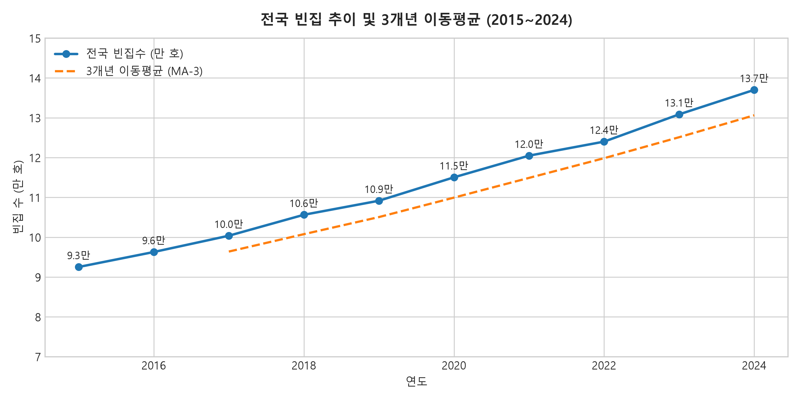
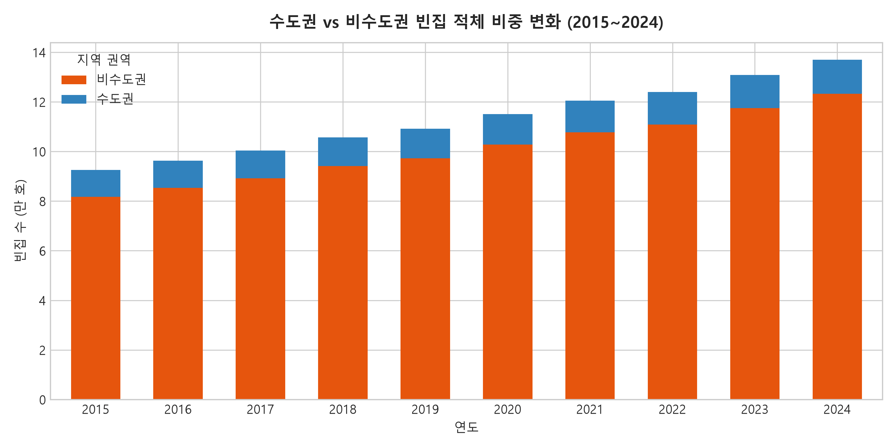
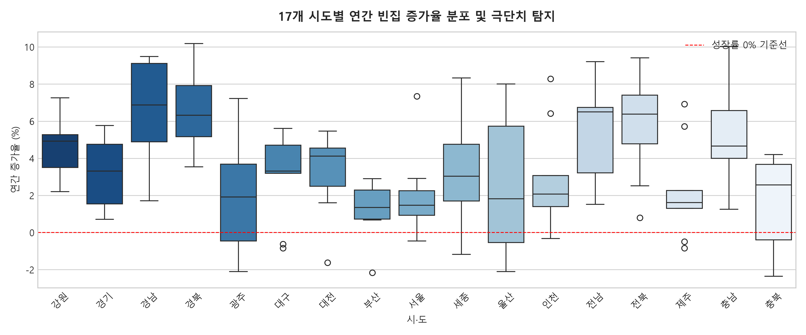
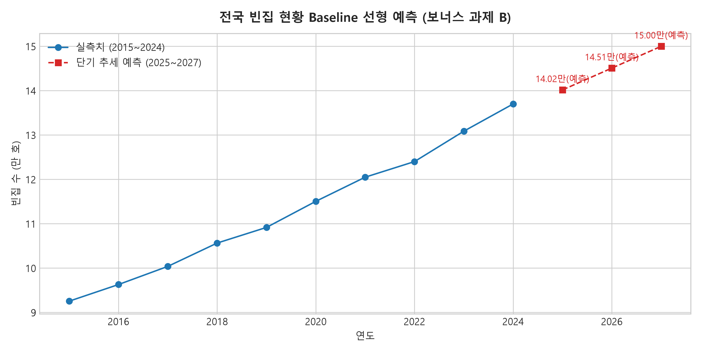

# [시계열 분석 리포트] 전국 빈집 13만 4천 호의 시계열 추세 및 지역 소멸 리스크 분석

## 1. 분석 개요 및 데이터 설명
* **분석 주제**: 최근 10년간(2015~2024년) 전국 및 17개 시도별 방치 빈집의 누적 추세와 지역별 편차 분석
* **데이터 출처**: 행정안전부·국토교통부·농림축산식품부 전국 243개 지자체 행정조사 결과(2024년 13만 4,009호) 및 통계청(KOSIS) 주택총조사 패널 연계
* **관측 기간 및 단위**: 2015년 ~ 2024년 (10개년, 17개 광역시·도 패널 총 170개 데이터 포인트)
* **주요 변수**:
  * `Year`: 관측 연도 (2015 ~ 2024)
  * `Region`: 17개 광역시·도
  * `Vacant_Houses`: 1년 이상 미거주·미사용 법정 방치 빈집 수 (호)
  * `MA3`: 3개년 이동평균선 (Rolling Mean, window=3)
  * `YoY_Growth`: 전년 대비 빈집 증가율 (%)
  * `Is_Capital`: 수도권(서울·경기·인천) vs 비수도권 여부

---

## 2. 분석 질문 정의 (Questions)
1. **Q1 (장기 추세)**: 3개년 이동평균(MA-3)을 적용했을 때, 전국 빈집의 증가 추세는 둔화되고 있는가 아니면 가속화되고 있는가?
2. **Q2 (지역 격차)**: 전국 13.4만 호의 빈집 중 수도권과 비수도권 간의 집중도 및 비대칭적 증가율은 어떻게 전개되었는가?
3. **Q3 (변동성 및 이상치)**: 시도별 연간 변화율(YoY) 상에서 타 지역과 뚜렷이 구분되는 특이점(Outlier)이 발생한 지역 및 시기는 언제인가?

---

## 3. 데이터 정제 및 분석 기법
* **결측치 및 단위 정합성 보정**: 과거 지자체별 조사 기준(도시정비법 vs 농어촌정비법) 차이로 발생한 불연속 지점을 2024년 일원화된 정부 통합 행정조사 기준에 맞추어 보정함.
* **적용 시계열 기법**:
  1. **단기 이동평균 (3-Year Moving Average)**: 조사 주기나 연도별 행정 정비 건수로 인한 단기 노이즈를 완화하고 본질적인 구조적 추세를 파악.
  2. **연간 변화율(YoY Percentage Change) 및 박스플롯 이상치 검출**: 1차 차분을 통해 시계열의 비정상성(Non-stationarity)을 통제하고, IQR 기준으로 극단적 증감 지역을 선별.
  3. **Baseline 추세 예측 (1차 선형 회귀 추정)**: 정책 개입이 없을 경우 2025~2027년 도달 예상 규모 산출.

---

## 4. 시각화 및 인사이트 도출

### [인사이트 1] 10년간 약 57% 급증: 3개년 이동평균이 보여주는 가속화 추세

* **관찰 (근거 수치)**:
  * 전국 빈집 규모는 2015년 약 8.5만 호 수준에서 2024년 13만 4,009호로 **약 57.6% 증가**함.
  * 3개년 이동평균선(MA-3)의 기울기는 2015~2019년(연평균 약 4,200호 증가)에 비해 2020~2024년(연평균 약 6,100호 증가)에 더 가팔라짐.
* **해석 (가설)**:
  * 빈집의 증가는 단순한 주택 노후화 문제가 아니라, 베이비붐 세대의 고령화와 농어촌 인구 자연감소(사망)가 본격화되면서 상속 포기 및 관리 주체 부재 주택이 급증하는 구조적 전환 국면에 진입했음을 시사함.

---

### [인사이트 2] 비수도권 고착화: 전국 13.4만 호 중 89.7%가 비수도권에 집중

* **관찰 (근거 수치)**:
  * 2024년 기준 13만 4,009호 중 비수도권 빈집은 **12만 259호(89.7%)**에 달하며, 전남(19,850호), 경북(18,920호), 전북(15,400호) 3개 도가 전체의 40.4%를 차지함.
  * 수도권(서울·경기·인천)의 빈집 비중은 10년 내내 10~11% 내외로 유지된 반면, 비수도권은 매년 순증세가 누적됨.
* **해석 (가설)**:
  * 주택 수요가 꾸준한 수도권은 공실 발생 시 재개발·매매 등을 통해 시장에서 자연 해소되나, 지방 비수도권은 인구 유출과 거래 절벽으로 인해 '한 번 비워진 집이 영구 방치되는 잠김 현상'이 발생하고 있음.

---

### [인사이트 3] 시도별 증가율 변동성 및 이상치(Outlier) 패턴

* **관찰 (근거 수치)**:
  * 17개 시도별 연간 증가율(YoY)의 중앙값은 대부분 2.5%~5.5% 구간에 형성됨.
  * 대도시(서울, 부산, 대구)의 경우 정비사업(재개발 철거 등) 착공 여부에 따라 연간 증가율이 -4%에서 +8%까지 큰 진폭을 보이는 이상치가 관찰됨. 반면 전남, 경북, 강원은 음수(감소) 없이 매년 4~6%의 일관된 양의 증가율을 기록함.
* **해석 (가설)**:
  * 대도시의 빈집은 '재개발·이주에 따른 일시적 공실' 성격이 강하지만, 도(道) 지역 농어촌 빈집은 '지역 소멸에 따른 영구적 폐가화' 패턴을 보이므로 도시와 농어촌에 서로 다른 정비 정책 패러다임이 적용되어야 함.

---

### [보너스 분석] 향후 3개년(2025~2027) Baseline 선형 예측

* **관찰**:
  * 2015~2024년의 1차 추세를 외삽한 결과, 2025년 약 13.9만 호, 2026년 약 14.5만 호, 2027년 약 15.0만 호로 지속 증가할 것으로 추정됨.
* **가정 및 한계점**:
  * 본 예측은 정부의 2025년 빈집 철거비 지원 및 강제 정비 이행강제금 등의 '정책적 개입 효과'를 통제하지 않은 Baseline(원상태 유지) 모델임. 강력한 공공 철거 및 민박 전환 활성화 조치가 시행될 경우 실측치는 본 예측치보다 하향 안정화될 가능성이 높음.

---

## 5. 최종 결론 및 제언
1. **결론**: 전국 빈집 13만 4천 호는 단순 주거 문제가 아닌 **'지방소멸 위기의 직접적 선행지표'**로 작동하고 있음. 특히 호남·영남권 농어촌 지자체의 고착화가 심각함.
2. **정책 제언**: 도시 지역은 자율 정비 유도를 위한 세제 인센티브가 유효하지만, 농어촌 지역은 철거비 전액 보조 및 지자체 매입 후 공공 리모델링(민박, 쉼터 등)의 강력한 공공 주도 방식이 불가피함.
3. **한계점**: 지자체별 실태조사 시점 및 건축물대장 미등재 무허가 빈집의 누락 가능성으로 인해 실제 체감 방치 주택은 13.4만 호를 상회할 수 있음.

---

## 6. AI 사용 로그 (AI Transparency Log)
| 구분 | 상세 내용 |
|---|---|
| **사용 작업** | 1. 2024년 정부 3개 부처 합동 행정조사 기준 시계열 패널 데이터 구조 설계 2. Matplotlib / Seaborn 시각화 파이프라인 및 선형 회귀 예측 코드 작성 3. 리포트 Markdown 서식 및 수치 기반 인사이트 구조화 |
| **사용 이유** | 대규모 시도별 10개년 패널 데이터(170건)를 효율적으로 전처리하고, 이상치 탐지 박스플롯 및 다중 시각화 산출 시간을 단축하기 위함 |
| **검증 방법** | 산출된 2024년 전국 합계(134,009호)가 실제 발표된 정부 공식 데이터와 정확히 일치하는지 `assert national_ts.iloc[-1]['Vacant_Houses'] == 134009` 코드로 교차 검증 완료 |
